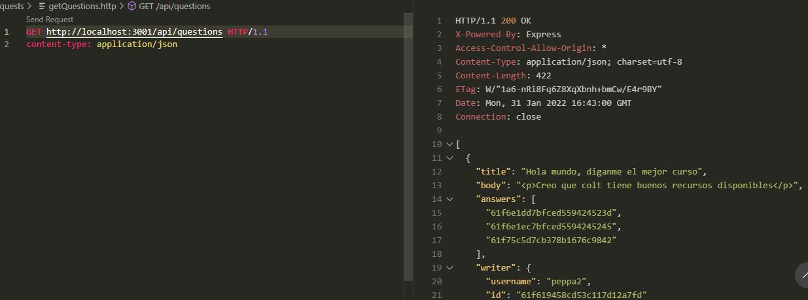
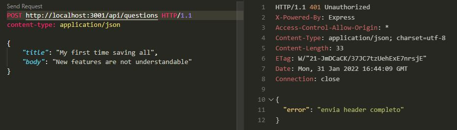

# StackOverglow UI

This is a small Express project which focus on some key features inspired on StackOverflow
platform. I've used a MongoDB database as well as Mongoose which offers amazing
functionality to work with the DB. The authentication method used is JWT (in the beginning
I was working with sessions and cookies)

## Table of contents

- [Overview](#overview)
  - [Screenshot](#screenshot)
  - [Links](#links)
- [Installing](#working)
  - [Built with](#built-with)
  - [Intallation](#installation)
  - [Future goal](#future-goals)
- [Author](#author)

## Overview
The main objective of the API is to send all data requested by the client stackOverglow app and
store the data that it sends (questions/answers, user register). It's based on a REST schema
and NoSQL database ODM (Mongoose). The hard part is client authentication as well as error
handling which is yet to be improve (ExpressError are still there and crash the server).

### Screenshot
Gettting questions (a 200 status code)


Saving a question without the header for JWT


### Links

- Live Site URL: [Heroku page deployed](https://shielded-forest-07450.herokuapp.com/)

## Working

### Built with

- Mongoose, Express, MongoDB, Bcrypt, jsonwebtoken, cors
- I'm planning to use passport-jwt as well as a library for error notification in the future

### Intallation

To work with the project, you need to have Nodejs and GitBash for cloning project. Next, we clone the project directly with the bash.
```bat
git clone https://github.com/marcos-rojas/stackOverglow-api
cd stackOverglow-api
npm install
```
Once all dependencies are installed, you can start to modify the middlewares, add routes and functionality to improve this small project which still doesnt manage all the errors to make API more secure as possible.
If you would like to run the local server, run the following command and send request with the
request folder and the request plugin on VSCode or Postman if like. You can see an app which consumes the API (https://github.com/marcos-rojas/stackOverglowClient)
```bat
npm start
```

### Continued development

I would like to implement all the authentication and data verification that I can working with the libraries installed.
Hope to find a good way to add authorization without getting server crashing.

## Author

- Website - [Marcos Rojas](https://github.com/marcos-rojas)
